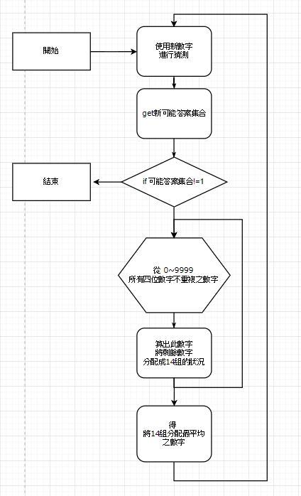

# GuessNumber1A2B

又稱Bulls and Cows、幾a幾b、1A2B遊戲

## 遊戲規則:

一個人出數字，一方猜。出數字的人要先想好一個沒有重複數字的4位數，例:8123，不能讓猜的人知道。猜的人就可以開始猜。每猜一個數，出數者就要根據這個數字給出幾A幾B，例猜1562，則為 0A2B ，其中A前面的數字表示位置正確的數的個數，而B前的數字表示數字正確而位置不對的數的個數。

接著猜的人再根據出題者的幾A幾B繼續猜，直到猜中為止。 

節錄自 [維基百科_猜數字](https://zh.wikipedia.org/wiki/%E7%8C%9C%E6%95%B0%E5%AD%97)

## 遊戲版使用說明

遊戲分成兩種模式 (一)電腦競賽模式 (二)單人遊戲模式

輸入數字1、2即可選擇模式

**(一)電腦競賽模式**

1. 遊戲開始請提供一個四位數值(且數字不能重複)供電腦來進行猜測，同時電腦也會為玩家隨機出好一組數字。

2. 輸入數值就可以開始進行猜測，一旦有一方贏了，遊戲即立刻結束，玩家可以詳細看到自己與電腦猜測的過程。

**(二)單人遊戲模式**

1. 輸入數值就可以開始進行猜測，遊戲直到玩家猜對才結束。

## 演算法設計過程

**(1) 直觀計算方式**

每次猜測後都將可能是答案的集合列出來，多猜測一次，就更改答案可能集合，猜得越多次答案集合越小，最後找出最終答案

使用這個方式，若可能答案集合越大，就得猜測越多次=>不採用

**(2) 使用**

從上述結論可看出，為了使猜測次數減少，可能答案集合必須越小越好。

此遊戲得到回覆共有14種可能 : 0A0B、0A1B、0A2B、0A3B、0A4B、1A0B、1A1B、1A2B、1A3B、2A0B、2A1B、2A2B、3A0B、4A0B

每次猜測後，我們去測試0~9999(四位數字需不重複)內所有依然在可能答案集合內的數，

測試看看倘若以他們為猜測數，其他剩餘數字會如何分配在這14組中，選擇分配得最平均的。

選出後即以他為下一個猜測數字，每一次猜測便可得到最小的可能答案集合。

(此處並沒有使用標準差去判斷各組分配狀況，改使用 **組內最多成員數-組內最少成員數** 結果來推判)

**(3) 結果**

多次測試平均每次只要4、5次即可猜出最佳答案

內容發想自 [分類最優化---猜數字遊戲的最佳策略](http://www.shs.edu.tw/works/essay/2015/03/2015032623412612.pdf)  

